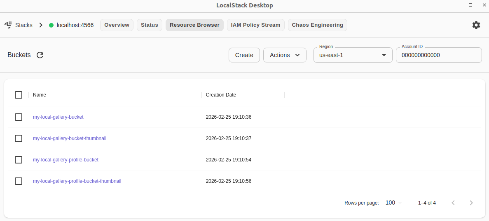

# Cloud Provider - Localstack(Simulated AWS)

The entire project infrastructure is simulated locally using Docker and LocalStack. This allows developing and testing AWS services like S3, SNS, SQS, and OpenSearch without costs and in a completely isolated development environment.

## Exploring Services (LocalStack Desktop)

To visualize and manage resources created in LocalStack (S3 buckets, SQS queues, SNS topics), we recommend using the **LocalStack Desktop App**.

### How to download

1. Access the official download page: [LocalStack Desktop App](https://docs.localstack.cloud/aws/capabilities/web-app/localstack-desktop/)
2. Choose the version compatible with your operating system (Windows, macOS, or Linux).
3. Install and configure the endpoint to `http://localhost:4566` (default LocalStack endpoint configured in this project).

This will allow you to visually explore the image bucket and the messages moving through the queues during upload.

### Free Plan

Since the free Localstack plan doesn't retain created resources (S3 buckets, SQS queues, etc.) when the container is stopped or restarted, 
I created a set of bash scripts that create all the resources needed by the application. 
Resource creation is based on the application's business flows, and there are also useful functions for creating resources to meet new 
flows or for extending existing ones.

You find those scripts on [awslocalstack/bin](./bin)

Those scripts are called to deploy application needed resources during the application start process as you may notice.

Once the project is up and running and you have the desktop application installed and authenticated, 
you will be able to explore the features as demonstrated below.

