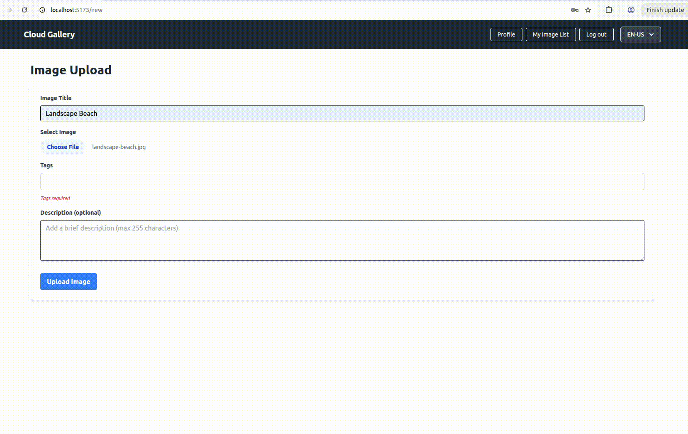
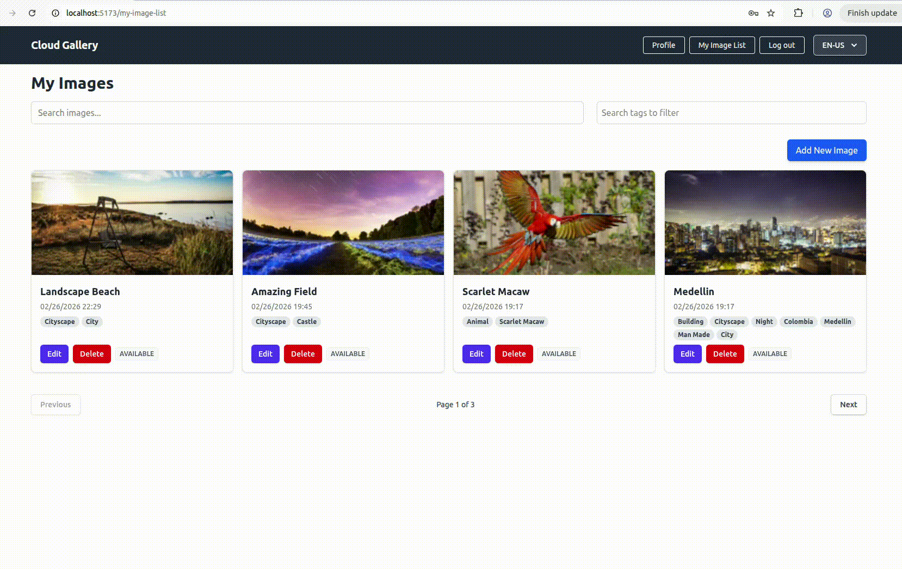

# Frontend (React SPA)

The frontend is a modern Single Page Application (SPA) developed with React, Vite, and Tailwind CSS. It provides an intuitive interface for users to upload, view, and search for images with high performance, leveraging the backend's asynchronous capabilities.

## Image processing demonstration

Here you can see how the image upload process works; initially, the item will have a "processing" status, and after some time, the image will become available for public access.



## Performance Optimization

The application uses advanced performance optimization techniques to ensure a smooth experience and avoid unnecessary re-renders in components that do not directly depend on the changed state.

### Actions Memoization (Stable Objects)

In `ImageListContext`, the state update functions (setters) are grouped into a memoized object called `actions`.

```javascript
const actions = useMemo(
  () => ({
    setSearchTerm,
    setPagination,
    setFilterTagIds,
  }),
  [] // Empty dependencies ensure the object is stable
);
```

**Why is this important?**
1. **Reference Stability:** The `actions` object remains the same throughout the application's lifecycle.
2. **Re-render Prevention:** Components that only use actions (such as search bars or filters) and are wrapped in `React.memo` will not re-render when other context states (like the items list or loading state) change.

### Demonstration: Avoiding Re-renders

The video below demonstrates how the application behaves when interacting with filters, highlighting that only the strictly necessary components are updated, maintaining a high-performance interface.

